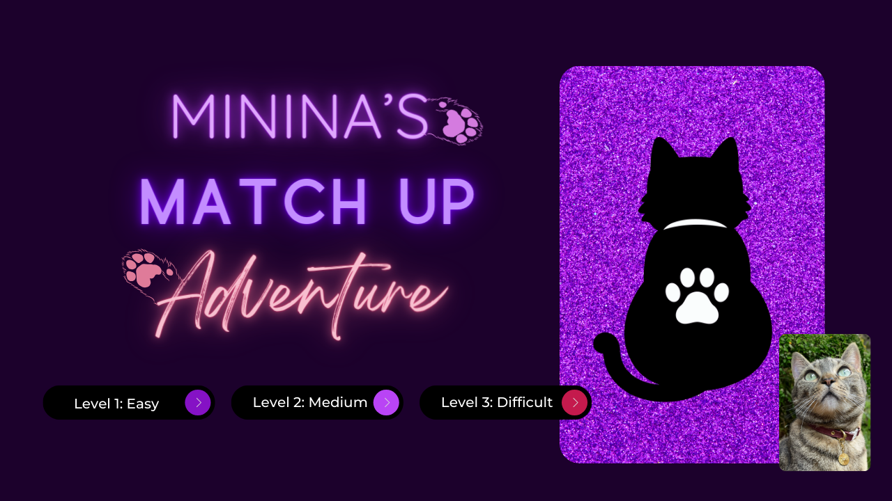
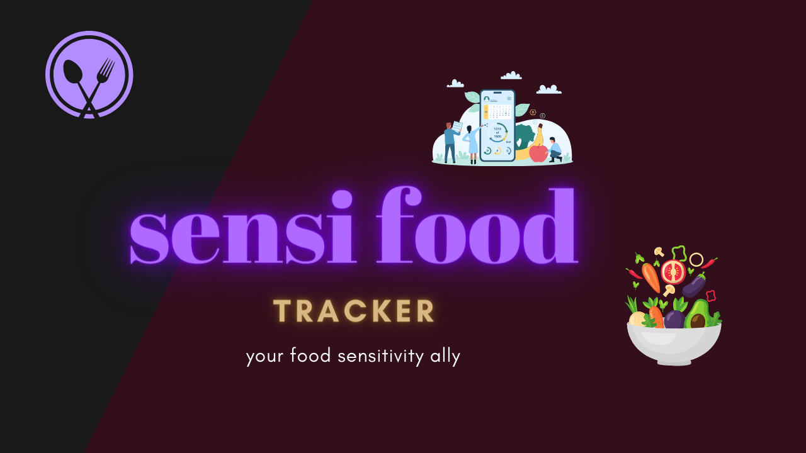

  <h1>Hi there, I'm Carla! 👋</h1>

## About Me
I'm a Full Stack Software Engineer based in New York City with a background in Marketing and Customer Success at MarTech SaaS companies. I'm deeply passionate about coding and open source projects, and you can explore my work on my GitHub profile. Feel free to delve into my repositories and contribute to any projects that pique your interest.

### Fun facts: 🌟
My hobbies include reading, savoring a good cup of coffee, amassing an excessive number of mugs, and enthusiastically discussing cats, especially my own.

## Skills

      
      
      
      
      
      
      
      
      
      <a href="#"> <a/>
      
      
      
      
      
      
      
      
      
      

### Explore My Projects 

Here are some of my highlighted projects:

Fantastic Books:  [Back-End Repo](https://github.com/cmpacheco23/fantastic-books-back-end) [Front-End Repo](https://github.com/cmpacheco23/fantastic-books-front-end)
   
  

Minina Match Game: [GitHub Repository](https://github.com/cmpacheco23/minina-match-game)
   
  

Sensi Snacker Tracker: [GitHub Repository](https://github.com/cmpacheco23/sensi-snacker-tracker)
   
  

### Contact Me

Let's connect! You can reach me at [cpacheco.nyc@gmail.com](mailto:cpacheco.nyc@gmail.com) or find me on:
 

 

